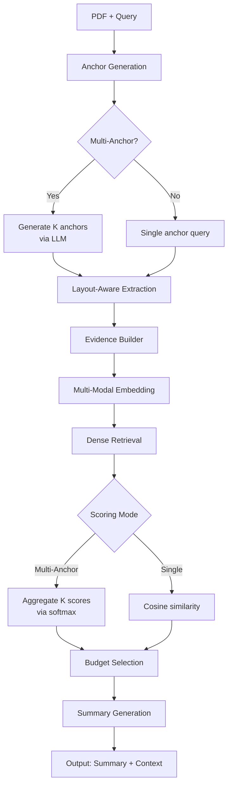
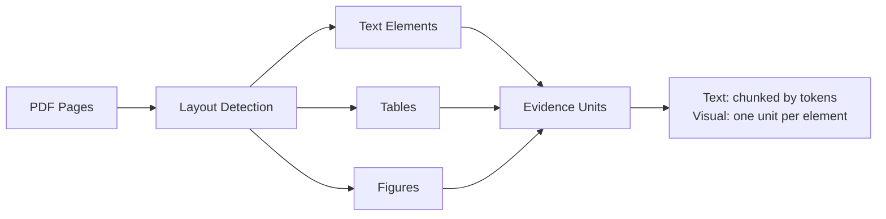
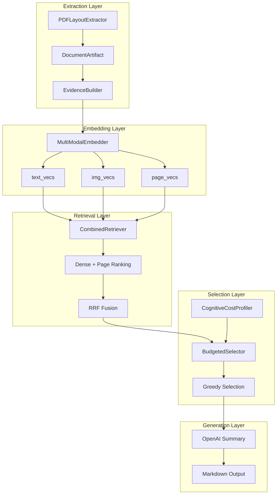

# DPP-Retrieval: Budget-Constrained Multimodal PDF Retrieval

Query-driven evidence extraction from PDFs using budget-constrained selection with redundancy penalties.

## Overview

Given query $q$ and PDF document $D$, extract evidence units $\mathcal{S} \subseteq \mathcal{U}$ maximizing relevance while minimizing redundancy under token budget $B$.

### Objective Function

$$
\mathcal{S}^* = \arg\max_{\mathcal{S}} \sum_{u \in \mathcal{S}} \left[ \alpha \cdot r(u, q) - \beta \cdot \max_{v \in \mathcal{S} \setminus \{u\}} \text{sim}(u, v) \right]
$$

subject to: $\sum_{u \in \mathcal{S}} c(u) \leq B$

where:
- $r(u, q)$: relevance score (cosine similarity or multi-anchor aggregation)
- $\text{sim}(u, v)$: cosine similarity between embeddings
- $c(u)$: cognitive cost (tokens + visual penalty)
- $\alpha, \beta$: relevance and redundancy weights

## Pipeline



## Core Algorithms

### 1. Multi-Anchor Scoring

For $K$ anchor queries $\{a_1, \ldots, a_K\}$:

$$
r(u, q) = \sum_{k=1}^K w_k \cdot \langle \mathbf{e}_u, \mathbf{e}_{a_k} \rangle
$$

where weights: $w_k = \frac{\exp(\langle \mathbf{e}_q, \mathbf{e}_{a_k} \rangle / \tau)}{\sum_j \exp(\langle \mathbf{e}_q, \mathbf{e}_{a_j} \rangle / \tau)}$

### 2. Evidence Building



### 3. Greedy Selection

```python
while budget_remaining > 0:
    u* = argmax_{u ∈ candidates} [α·r(u) - β·max_sim(u)] / c(u)
    if gain(u*) < min_gain:
        break
    S ← S ∪ {u*}
    budget_remaining -= c(u*)
```

### 4. Cognitive Cost Model

$$
c(u) = \text{tokens}(u) \cdot (1 + \gamma \cdot n_{\text{images}}(u) + \delta \cdot \rho(u))
$$

where:
- $\gamma$: visual attention penalty (`alpha_visual`)
- $\rho(u)$: reasoning complexity (optional embedding-based)

## Architecture



## Usage

```bash
python main.py \
    --pdf paper.pdf \
    --query "What are the training details for DDPM?" \
    --config config/default_config.yaml
```

### Key Parameters

| Parameter | Description | Default |
|-----------|-------------|---------|
| `budget_tokens` | Maximum context size | 4000 |
| `redundancy_beta` | Redundancy penalty $\beta$ | 0.1 |
| `rel_weight` | Relevance weight $\alpha$ | 1.0 |
| `multi_anchor.anchor_count` | Number of anchor queries $K$ | 5 |
| `multi_anchor.temperature` | Softmax temperature $\tau$ | 1.0 |
| `selection.alpha_visual` | Visual cost penalty $\gamma$ | 0.35 |

## Selection Strategies

Three selection modes (see [`optimizer.py`](src/optimizer.py)):

1. **Greedy**: Pure relevance-redundancy tradeoff
   - Gain: $\alpha \cdot r(u) - \beta \cdot \max\text{sim}(u)$

2. **TopK**: Rank by relevance, fill budget
   - No redundancy penalty

3. **Greedy+Coverage**: Adds query aspect coverage
   - Gain: $\alpha \cdot r(u) + \lambda \cdot \text{cov}(u) - \beta \cdot \max\text{sim}(u)$
   - Where $\text{cov}(u)$ counts new query terms covered

## Output

```
output/
├── summary.md              # Final summary
├── context.json           # Full context (greedy)
├── context_topk.json      # TopK baseline
├── context_greedy_cov.json # Coverage variant
├── diagnostics.png        # Selection visualization
└── highlighted.pdf        # Annotated PDF
```

## Configuration

Edit [`config/default_config.yaml`](config/default_config.yaml):

```yaml
retrieval:
  top_units_dense: 150      # Candidate pool size
  unit_image_weight: 1.15   # Image embedding weight

selection:
  budget_tokens: 4000
  redundancy_beta: 0.1      # β: redundancy penalty
  cognitive_cost_mode: emb  # 'simple' | 'emb'

multi_anchor:
  enabled: true
  anchor_count: 5           # K anchors
  temperature: 1.0          # τ for softmax
```

## Mathematical Details

### RRF Score Fusion

Reciprocal Rank Fusion with constant $k$:

$$
\text{RRF}(u) = \sum_{r \in \text{rankings}} \frac{1}{k + \text{rank}_r(u)}
$$

### Unit Vector Composition

$$
\mathbf{v}_u = \text{norm}\left(\mathbf{v}_{\text{text}} + \omega \cdot \mathbf{v}_{\text{img}}\right)
$$

where $\omega$ = `unit_image_weight`

### Multi-Anchor Aggregation

Temperature-scaled attention over anchors:

$$
r(u, q) = \sum_{k=1}^K \frac{\exp\left(\frac{\langle q, a_k \rangle}{\tau}\right)}{\sum_j \exp\left(\frac{\langle q, a_j \rangle}{\tau}\right)} \cdot \langle u, a_k \rangle
$$

## Dependencies

```bash
pip install numpy torch transformers sentence-transformers openai PyYAML
```

## Evaluation

Run batch evaluation:

```bash
python run_batch_eval.py --metadata data/metadata.json
```

See [`eval_engine/`](eval_engine/) for evaluators.

## References

- Budget-constrained retrieval with redundancy penalty
- Multi-anchor query expansion for diverse evidence
- Cognitive cost modeling for multimodal content
- Layout-aware PDF extraction with vision models

---

**License**: MIT
**Contact**: See repository
